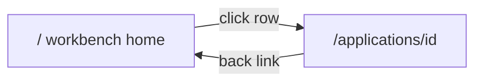

# Frontend Plan — Next.js SME Risk Workbench

**Status:** planning only. Do not write application code until someone explicitly asks to execute or implement.

**Stack (locked):** Next.js 14+ (App Router) + TypeScript + Tailwind CSS.

**App root (locked):** `frontend/`. This file is the single source of truth for the hackathon frontend.

This is an internal underwriter tool. It is not a marketing site. The only functional routes are Home and Application Detail. Modals cover new-application and decision confirm. There is no About page and no Contact page.

---

## 1. What the UI serves

An AI-assisted workbench for SME loan cases. Analysts queue applications, inspect evidence, read an AI **recommendation**, and record a human decision. The browser never calls a model and never computes the risk score.

| Layer | Source |
| --- | --- |
| Application rows | [`materials/master_sme_credit_risk_dataset_10k.csv`](../materials/master_sme_credit_risk_dataset_10k.csv) |
| Core loan fields (24 columns, also columns 1–24 of the master file) | [`materials/comprehensive_sme_loan_data_10k.csv`](../materials/comprehensive_sme_loan_data_10k.csv) |
| Document checklist | [`materials/sme_document_registry_10k.csv`](../materials/sme_document_registry_10k.csv) |
| Extra risk signals | [`materials/sme_advanced_features_10k.csv`](../materials/sme_advanced_features_10k.csv) |
| Policy RAG corpus | PDFs ingested by the backend (Reg B, Reg P, Basel III, NIST AI RMF, and related policy). The frontend only renders citations the API returns. |
| Guidelines | [`guidelines/`](../guidelines/) — Genius Hacks Connect + AI-First SDLC |

Join key for every CSV is `Business_ID` (example: `SME-10000`).

The master file is the denormalized join: 24 comprehensive columns + 16 document columns + `Completeness_Score` + 12 advanced-feature columns = **53 columns, 10,000 rows**. Phase 1 mock data may be sliced from the master file. Production list calls must be paginated. Never load the full 10k CSV in the browser.

`Loan_Status` in the CSV (`Approve` / `Defer` / `Reject`) is the dataset label for demo and eval. It is not the workbench decision. The human review badge starts as `pending` until `POST .../decisions`.

Backend may start in [`0_old/0_backend/`](../0_old/0_backend/) and evolve. The frontend depends only on the contract in section 8.

---

## 2. Rules the UI must show

From Genius Hacks Connect and the AI-First SDLC guidance:

- The system prepares. A person decides. Nothing is approved, deferred, or rejected automatically.
- AI output is a recommendation with citations. It is not a final approval and it is not the official score owner.
- Document evidence and policy citations are visible on the case before the case can be closed.
- A human can disagree with the recommendation, must record why, and that reason is stored on the audit trail.
- Synthetic data only. No real customer or regulator extracts in the UI or in frontend env.
- No LLM API keys in frontend env. Chat and assessment go through the backend API.
- Every async view has a loading state, an error state, and an empty state.

**Copy that is allowed**

- `AI recommendation: Defer`
- Banner: `Underwriter must confirm final decision.`

**Copy that is not allowed**

- `AI Approved` as a final outcome
- Any badge that marks the case closed before the Decision tab is submitted

---

## 3. Routes



| Route | File | Purpose |
| --- | --- | --- |
| `/` | [`frontend/app/page.tsx`](app/page.tsx) | Dashboard + application queue table |
| `/applications/[id]` | [`frontend/app/applications/[id]/page.tsx`](app/applications/[id]/page.tsx) | Single loan case with tabs + AI chat |

Modals, not routes: New application, confirm decision.

Unknown `id` shows an empty/error state on the detail page with a link back to Home. It does not 404 into a marketing page.

---

## 4. Project structure

```
frontend/
  plan.md                          # this file + build prompts
  package.json
  next.config.ts                   # API proxy to FastAPI in dev
  tailwind.config.ts
  app/
    layout.tsx                     # Shell: sidebar + header
    page.tsx                       # Home / workbench
    applications/[id]/page.tsx     # Application detail
    globals.css
  components/
    layout/AppShell.tsx
    home/StatCards.tsx
    home/ApplicationTable.tsx
    home/NewApplicationModal.tsx
    detail/SummaryTab.tsx
    detail/DocumentsTab.tsx
    detail/AssessmentTab.tsx
    detail/PolicyTab.tsx
    detail/DecisionTab.tsx
    detail/AuditTab.tsx
    detail/AiChatBar.tsx
    ui/StatusBadge.tsx
    ui/DocStatusIcon.tsx
  lib/
    api/client.ts                  # fetch wrapper → backend
    api/types.ts                   # Application, Assessment, Citation, Decision
    mock/applications.ts           # Phase 1: static slice from CSV
  public/
```

`AppShell` wraps every page: top header and an optional narrow sidebar. The sidebar MVP item is a Home link only. Demo user in the header: **Jane Doe, Underwriter** (static; no auth).

---

## 5. Home (`/`)

### Wireframe

```
┌──────────────────────────────────────────────────────────────┐
│  SME Risk Workbench                    Jane Doe, Underwriter │
├──────────────────────────────────────────────────────────────┤
│  [Pending review]  [Awaiting AI input]  [Completed]          │
│  [ + New application ]   Search [____]   Stage | Docs | Review│
│  ┌────────────────────────────────────────────────────────┐  │
│  │ App ID │ Company │ Industry │ Amount │ Credit │ Docs │ … │  │
│  └────────────────────────────────────────────────────────┘  │
│  Pagination: 20 rows/page          Prev  1  2  3  Next        │
└──────────────────────────────────────────────────────────────┘
```

### Stat cards

Counts come from `GET /api/v1/metrics` (mock: count the current dataset). Buckets are mutually exclusive:

| Card | Rule |
| --- | --- |
| Awaiting AI input | Review is `pending` and AI status is `not_started` or `running` |
| Pending review | Review is `pending` and AI status is `ready` |
| Completed | Review is `approved`, `deferred`, or `rejected` |

### Toolbar

- **+ New application** opens `NewApplicationModal` (form, or pick a `Business_ID` from the seed list). Submit calls `POST /api/v1/applications`.
- Search matches `Business_ID` or `Business_Name` (business names may contain commas and quotes).
- Filters: stage (the three buckets above), doc status (clear / missing / forged), review status (`pending` / `approved` / `deferred` / `rejected`).

### Table

| UI column | CSV / API field |
| --- | --- |
| App ID | `Business_ID` |
| Company | `Business_Name` |
| Industry | `Industry` |
| Amount | `Loan_Amount_Requested` (USD) |
| Credit | `Owner_Credit_Score` |
| Docs | Derived from the registry. See icon rules below. |
| AI status | Backend: `not_started` / `running` / `ready`. Not a CSV column. |
| Review | `pending` / `approved` / `deferred` / `rejected` |

Row click navigates to `/applications/{Business_ID}`.

**Doc icon**

| Icon | Rule |
| --- | --- |
| Green | No `Forged` cell, no `Missing` cell. `Not_Required` counts as clear. `Document_Verification` is `Verified`. |
| Yellow | Any document cell is `Missing`, or `Document_Verification` is `Missing_Critical_Docs`, and nothing is forged. |
| Red | Any document cell is `Forged`, or `Document_Verification` is `Forged_Documents`. |

### Pagination

20 rows per page. Query `page` and `limit`. The Home table never holds all 10,000 rows in client state. Phase 1 mock may hold about 20 rows and still paginate that slice.

---

## 6. Application detail (`/applications/[id]`)

### Top bar

Back link to `/` · title `{Business_ID} · {Business_Name}` · button **Run AI Assessment** (`POST /api/v1/applications/{id}/run`). While a run is in progress, the button shows a spinner and AI status is `running`.

### Banner (always visible on this page)

> AI recommendation is not final. Underwriter must confirm the decision.

### Tabs (one page, not separate routes)

| Tab | Content | Source |
| --- | --- | --- |
| Summary | Business, financials, owner credit, loan purpose | Master / comprehensive columns 1–22, plus `Document_Verification` and `Loan_Status` as labels |
| Documents | Document grid + completeness score | `sme_document_registry` |
| Assessment | AI recommendation (not final), score, risk factors | Backend `/run` response. Advanced-feature columns may appear as factors. |
| Policy | RAG citations from PDFs | Backend policy hits |
| Decision | Approve / Defer / Reject + justification | `POST /api/v1/applications/{id}/decisions` |
| Audit | Event timeline | Backend audit events |

### Summary tab

Four cards:

| Card | Fields |
| --- | --- |
| Business | `Business_Name`, `Owner_Name`, `US_State`, `Industry`, `Years_in_Business`, `Owner_Ownership_Percent`, `Market_Condition` |
| Financials | `Annual_Revenue`, `Monthly_Revenue`, `EBITDA`, `Operating_Profit`, `Net_Profit_Margin`, `Operating_Cash_Flow`, `Debt_to_Equity_Ratio`, `Current_Ratio` |
| Owner credit | `Owner_Monthly_Income`, `Owner_Credit_Score`, `Previous_Defaults` |
| Loan request | `Loan_Amount_Requested`, `Loan_Purpose`, `Last_Loan_Amount` |

Show `Loan_Status` on this tab only as **Dataset label**, separate from the human review badge.

### Documents tab

Header: `Completeness_Score` (CSV stores 0–1, for example `1.0`, `0.85`; display as a percent).

The registry has **16** document columns, not 15. Render all of them. Do not drop `Collateral_Proof`.

| # | Field | Cell values |
| --- | --- | --- |
| 1 | `EIN_Letter` | `Verified` / `Missing` / `Forged` / `Not_Required` |
| 2 | `Formation_Articles` | same |
| 3 | `Governance_Bylaws` | same |
| 4 | `Business_License` | same |
| 5 | `Commercial_Lease` | same |
| 6 | `Tax_Returns_2Yrs` | same |
| 7 | `Bank_Statements_6Mo` | same |
| 8 | `PnL_YTD` | same |
| 9 | `Balance_Sheet` | same |
| 10 | `Debt_Schedule` | same |
| 11 | `Owner_Gov_ID` | same |
| 12 | `Personal_Financial_Statement` | same |
| 13 | `Credit_Report_Auth` | same |
| 14 | `Business_Plan` | same |
| 15 | `SBA_Forms` | same |
| 16 | `Collateral_Proof` | same |

Highlight the case in red when `Document_Verification` is `Forged_Documents` or `Missing_Critical_Docs`. `Not_Required` is not a failure.

### Assessment tab

- Risk band, numeric score, factor list.
- Heading text is **AI recommendation** plus the suggested action (`Defer`, `Approve`, or `Reject`). Never **AI Approved** as the case outcome.
- Empty state before the first run, with the Run AI Assessment action.
- Loading state while `/run` is in flight.
- The score is displayed from the API payload. The frontend does not calculate it.

Advanced signals the assessment may cite (from `sme_advanced_features_10k.csv`):

| Field | Role |
| --- | --- |
| `NSF_Last_6_Months` | Risk factor |
| `Average_Daily_Balance` | Risk factor |
| `Revenue_Volatility` | Risk factor |
| `Customer_Concentration` | Risk factor |
| `Online_Rating`, `Review_Volume`, `Website_Active` | Context |
| `Recent_Hard_Inquiries_90D`, `Credit_Utilization_Ratio`, `Age_Oldest_Trade_Line_Months` | Credit signals |
| `Local_Unemployment_Rate`, `Industry_Growth_Forecast` | Macro context |

### Policy tab

Cards for each `PolicyCitation`: document name, quoted span, relevance. Empty state includes **Find relevant policy**, which calls `POST /api/v1/applications/{id}/run` or the dedicated policy step the backend exposes. If retrieval returns nothing, say so. Do not invent a citation in the client.

### Decision tab

- Choices: Approve, Defer, Reject.
- Justification textarea. Required when the choice differs from the AI recommendation. Also required when there is no AI recommendation yet, so the audit trail always has a reason.
- Submit calls `POST /api/v1/applications/{id}/decisions`.
- Success toast, then the review badge updates (`Approve` → `approved`, `Defer` → `deferred`, `Reject` → `rejected`).
- Confirm in a modal before submit. The case is not closed until this submit succeeds.
- The human decision panel is visible on the case before it can show as Completed.

### Audit tab

Timeline of backend audit events (run started, recommendation ready, human decision, chat ask). Empty until the API returns events. Optional for MVP polish (Phase 5) but the tab exists from Phase 3 so the shell does not change later.

### AI chat bar

Fixed to the bottom of the detail page only (not on Home).

- Input placeholder: `Ask about this application...`
- Sends `POST /api/v1/applications/{id}/ask` with the message. No LLM call from the browser.
- Assistant reply renders citation chips that select the matching Policy tab entry.
- Loading and error states. Streaming is optional; a single loading state is enough for MVP.

### Export

Button on the detail page calls `GET /api/v1/applications/{id}/package`. Phase 5. Disabled with an explanation when the API is unavailable.

---

## 7. CSV field reference

### Master file column order (53)

Verified against `materials/master_sme_credit_risk_dataset_10k.csv`.

| # | Column | UI home |
| --- | --- | --- |
| 1 | `Business_ID` | App ID; route param |
| 2 | `Business_Name` | Company |
| 3 | `Owner_Name` | Summary |
| 4 | `US_State` | Summary |
| 5 | `Industry` | Industry |
| 6 | `Market_Condition` | Summary |
| 7 | `Loan_Purpose` | Summary |
| 8 | `Years_in_Business` | Summary |
| 9 | `Owner_Ownership_Percent` | Summary |
| 10 | `Annual_Revenue` | Summary |
| 11 | `Monthly_Revenue` | Summary |
| 12 | `Owner_Monthly_Income` | Summary |
| 13 | `EBITDA` | Summary |
| 14 | `Operating_Profit` | Summary |
| 15 | `Net_Profit_Margin` | Summary |
| 16 | `Operating_Cash_Flow` | Summary |
| 17 | `Owner_Credit_Score` | Credit |
| 18 | `Previous_Defaults` | Summary |
| 19 | `Debt_to_Equity_Ratio` | Summary |
| 20 | `Current_Ratio` | Summary |
| 21 | `Loan_Amount_Requested` | Amount |
| 22 | `Last_Loan_Amount` | Summary |
| 23 | `Document_Verification` | Doc icon. Values seen: `Verified`, `Forged_Documents`, `Missing_Critical_Docs` |
| 24 | `Loan_Status` | Dataset label only. Values seen: `Approve`, `Defer`, `Reject` |
| 25–40 | 16 document fields | Documents tab (names in section 6) |
| 41 | `Completeness_Score` | Documents header |
| 42–53 | 12 advanced-feature fields | Assessment context (names in section 6) |

`comprehensive_sme_loan_data_10k.csv` is columns 1–24. `sme_document_registry_10k.csv` is `Business_ID` + columns 25–41. `sme_advanced_features_10k.csv` is `Business_ID` + columns 42–53.

---

## 8. API contract

Frontend calls these paths only. Dev proxy: `next.config.ts` rewrites `/api/:path*` → `http://localhost:8000/api/:path*`.

| Method | Endpoint | Used on |
| --- | --- | --- |
| GET | `/api/v1/applications?page=1&limit=20` | Home table. Also accept `search`, `stage`, `docStatus`, `reviewStatus`. |
| GET | `/api/v1/metrics` | Stat cards |
| GET | `/api/v1/applications/{id}` | Detail page |
| POST | `/api/v1/applications` | New application modal |
| POST | `/api/v1/applications/{id}/run` | Run assessment (and policy retrieval) |
| POST | `/api/v1/applications/{id}/decisions` | Decision tab |
| POST | `/api/v1/applications/{id}/ask` | AI chat bar |
| GET | `/api/v1/applications/{id}/package` | Export button |

### Shapes the UI reads

```ts
type AiStatus = "not_started" | "running" | "ready";
type ReviewStatus = "pending" | "approved" | "deferred" | "rejected";
type DecisionChoice = "Approve" | "Defer" | "Reject";
type DocCell = "Verified" | "Missing" | "Forged" | "Not_Required";

// GET /applications?page&limit → { items: Application[], page, limit, total }
// GET /metrics → { pendingReview, awaitingAi, completed }
// POST /applications/{id}/run → Assessment
// POST /applications/{id}/decisions → { reviewStatus, decision }
// POST /applications/{id}/ask body { message } → { reply, citations: PolicyCitation[] }

interface PolicyCitation {
  id: string;
  documentName: string;
  quotedSpan: string;
  relevance: number;
}

interface Assessment {
  recommendation: DecisionChoice; // label as "AI recommendation", never a final approval
  riskBand: string;
  score: number;
  factors: { name: string; detail: string }[];
  citations: PolicyCitation[];
}

interface Decision {
  choice: DecisionChoice;
  justification: string;
  overridesAi: boolean;
}

interface AuditEvent {
  id: string;
  at: string;
  type: string;
  summary: string;
}
```

`Application` includes the CSV columns in section 7 plus `aiStatus` and `reviewStatus`.

### Environment

```env
# frontend/.env.local
NEXT_PUBLIC_API_BASE_URL=
```

Empty string means same-origin (`/api/...` through the Next rewrite). Do not put provider keys in any `NEXT_PUBLIC_` variable.

### Phase 1 fallback

[`frontend/lib/mock/applications.ts`](lib/mock/applications.ts) exports about 20 applications parsed from the master CSV shape, including registry completeness. Pages use the API client. If the API returns **503**, fall back to that mock and show a small “demo data” notice. Other errors show the error state, not silent mock data.

---

## 9. Visual design (EVOQ-inspired)

| Element | Rule |
| --- | --- |
| Page background | Light grey `#f5f6f8` |
| Cards | White, rounded corners, light border or subtle shadow |
| Primary actions | Blue (New application, Run AI Assessment, Submit decision) |
| Status | Green verified/approved, yellow pending/defer/missing, red reject/forged |
| Table | Dense, professional, bank-internal. Horizontal scroll on small screens. |
| Type | Inter or system sans-serif |
| Sidebar | Optional, narrow, Home only for MVP |
| Tabs | Horizontal on desktop; stack or scroll on narrow screens |
| Chat | Fixed bottom bar on the detail page, above it the tab content scrolls |

---

## 10. Build phases

Check these off as work lands. Stay inside this file’s scope.

### Phase 1 — Scaffold

- [ ] `npx create-next-app@latest frontend --typescript --tailwind --app --eslint`
- [ ] App shell: header “SME Risk Workbench”, user “Jane Doe, Underwriter”, optional Home sidebar
- [ ] Routes `/` and `/applications/[id]` with placeholder content
- [ ] `next.config.ts` rewrite `/api/:path*` → `http://localhost:8000/api/:path*`
- [ ] `lib/api/types.ts` and `lib/mock/applications.ts` (~20 rows)
- [ ] No marketing routes

### Phase 2 — Home

- [ ] Stat cards: Pending review, Awaiting AI input, Completed
- [ ] Search, stage / doc status / review filters
- [ ] `ApplicationTable` with the eight columns and doc icon
- [ ] Pagination at 20 rows per page
- [ ] Row click → `/applications/[id]`
- [ ] `NewApplicationModal`

### Phase 3 — Detail tabs

- [ ] Top bar: back link, title, Run AI Assessment
- [ ] Banner: recommendation is not final
- [ ] Tab shell: Summary, Documents, Assessment, Policy, Decision, Audit
- [ ] Summary and Documents wired to mock, then API
- [ ] Assessment and Policy loading and empty states
- [ ] Decision form: justification required on override; confirm modal

### Phase 4 — Live backend + chat

- [ ] `lib/api/client.ts` for every endpoint in section 8
- [ ] `NEXT_PUBLIC_API_BASE_URL` defaulting to empty
- [ ] Swap pages to the client; keep mock fallback on 503
- [ ] Run assessment spinner / status
- [ ] `AiChatBar` with loading, error, and citation chips

### Phase 5 — Polish

- [ ] Error boundaries
- [ ] Skeleton loaders and empty states on every async view
- [ ] Export package button
- [ ] Audit tab timeline
- [ ] Responsive pass: table horizontal scroll, tabs usable on a narrow viewport

---

## 11. Copy-paste build prompts

Use one prompt at a time, in order. Do not skip the human-decision and citation rules in sections 2 and 6.

### Prompt 1 — Project scaffold

```
Create a Next.js 14 App Router project in frontend/ with TypeScript and Tailwind.
Add app/layout.tsx with a bank-style AppShell: top header (SME Risk Workbench, user name),
optional narrow sidebar (Home link only). Routes: / (home) and /applications/[id] (detail).
Add next.config.ts rewrite: /api/:path* -> http://localhost:8000/api/:path*.
Do not add marketing pages. Professional light theme like an internal underwriter tool.
```

### Prompt 2 — Types and mock data

```
In frontend/lib/api/types.ts define Application, DocumentStatus, Assessment, PolicyCitation,
Decision, AuditEvent matching materials CSV columns (Business_ID, Business_Name, Industry,
Loan_Amount_Requested, Owner_Credit_Score, Loan_Purpose, Document_Verification, Loan_Status, etc.).
In frontend/lib/mock/applications.ts export 20 sample applications parsed from
materials/master_sme_credit_risk_dataset_10k.csv structure. Include doc completeness from registry fields.
```

### Prompt 3 — Home page

```
Build frontend/app/page.tsx: three stat cards (Pending, Awaiting AI, Completed),
search input, filter dropdowns, and ApplicationTable with pagination (20 per page).
Columns: App ID, Company, Industry, Loan Amount, Credit Score, Doc status icon,
AI status badge, Human review badge. Row click navigates to /applications/[id].
Add NewApplicationModal triggered by + New application button. Use mock data first.
Match EVOQ underwriter workbench style: white cards on grey background.
```

### Prompt 4 — Application detail shell

```
Build frontend/app/applications/[id]/page.tsx with top bar (back link, title, Run AI Assessment button)
and tab navigation: Summary | Documents | Assessment | Policy | Decision | Audit.
Load application by id from mock then API. Fixed bottom AiChatBar on this page only.
Show banner: AI recommendation is not final — underwriter must decide.
```

### Prompt 5 — Summary and Documents tabs

```
SummaryTab: cards for Business (name, owner, state, industry, years), Financials (revenue, EBITDA,
margins, cash flow, ratios), Owner credit, Loan request (amount, purpose).
DocumentsTab: grid of 15 document types from sme_document_registry with Verified/Missing/Forged badges
and Completeness_Score header. Red row if Forged_Documents or Missing_Critical_Docs.
```

Prompt 5 says “15 document types”. The registry file has **16** document columns (`EIN_Letter` through `Collateral_Proof`), plus `Not_Required`. Implement all 16. Keep the red highlight for `Forged_Documents` and `Missing_Critical_Docs`.

### Prompt 6 — Assessment, Policy, Decision tabs

```
AssessmentTab: show risk band, numeric score, factor list, label "AI recommendation" not "AI Approved".
PolicyTab: list PolicyCitation cards (document name, quoted span, relevance). Empty state with
Find relevant policy button calling POST /applications/{id}/run or dedicated policy endpoint.
DecisionTab: select Approve/Defer/Reject, textarea justification required when overriding AI,
Submit button calling POST /applications/{id}/decisions. Show success toast and updated status.
```

### Prompt 7 — AI chat bar

```
AiChatBar component: input at bottom of detail page, sends POST /applications/{id}/ask with message.
Render assistant reply with inline citation chips linking to Policy tab entries.
Loading and error states. Do not call LLM from browser — API only.
```

### Prompt 8 — API client and env

```
Create frontend/lib/api/client.ts with typed fetch helpers for all /api/v1/applications endpoints.
Use NEXT_PUBLIC_API_BASE_URL env var defaulting to empty string (same-origin proxy).
Replace mock imports in pages with API calls; keep mock as fallback when API returns 503.
```

---

## 12. Guidelines checklist

These must be true in the running UI before the frontend is called done.

- [ ] Human decision panel is visible before a case shows as closed
- [ ] AI output is labeled as a recommendation, not a final approval
- [ ] Document evidence is visible (Documents tab, including forged and missing)
- [ ] Policy citations are visible (Policy tab and chat chips)
- [ ] No LLM keys in frontend env
- [ ] Loading, error, and empty states on every async view
- [ ] Home is paginated; the browser does not load all 10k rows

---

## 13. Out of scope for the frontend MVP

- Real authentication (static demo user is enough)
- About, Contact, or other marketing pages
- Kanban board
- Real Jira integration
- Loading the full 10k CSV in the browser
- Computing a risk score or calling a model from client code
- Parsing policy PDFs in the browser

---

## 14. Demo path (when the UI exists)

1. Open Home. Stat cards and the queue are visible.
2. Open a row with a weak credit score or a forged/missing doc icon.
3. Documents tab shows the checklist and completeness.
4. Run AI Assessment. The result reads as a recommendation, and the banner stays up.
5. Policy tab shows cited spans.
6. Decision tab: choose Defer (or another override) with a justification and confirm.
7. Chat: ask why the recommendation was made; citation chips open Policy.
8. Export, if the package endpoint is up.
