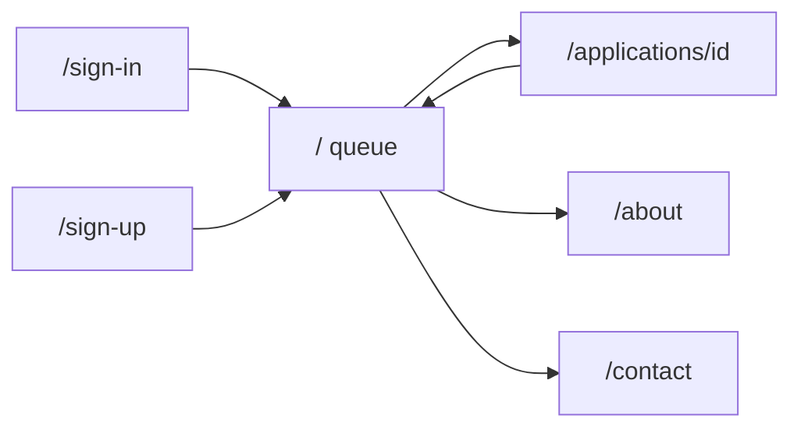

# SME Risk Workbench — Frontend v1 Build Prompts

**Purpose:** Copy-paste prompt pack to rebuild the entire Next.js frontend in `src/frontend/` from scratch.

**Companion doc:** After building, see [`frontend_v1.md`](frontend_v1.md) for a summary of what was delivered.

**How to use:** Read Part 0 once, then run Prompts 1–12 in order. Do not skip governance rules in Part 0.

---

## Part 0 — Master context

### Product

Build an **internal SME loan underwriting workbench** for bank analysts. This is not a marketing site.

Analysts:
1. Queue loan applications
2. Review document evidence and financials
3. Run an AI **assessment** (recommendation only)
4. Read policy citations
5. Record a **human** Approve / Defer / Reject decision
6. View an audit trail

The browser **never** computes a risk score and **never** calls an LLM directly. All scoring and AI go through the backend API (with mock fallback until FastAPI exists).

### Stack (locked)

| Layer | Choice |
|-------|--------|
| Location | `src/frontend/` |
| Framework | Next.js 16 (App Router) |
| Language | TypeScript |
| UI | React 19 |
| Styling | **Tailwind CSS v4 only** — no component libraries, no extra CSS files beyond `globals.css` |
| Auth | Clerk (`@clerk/nextjs`) |
| Data | API client + mock fallback |

### Routes



| Route | Auth | Purpose |
|-------|------|---------|
| `/sign-in` | Public | Clerk sign-in |
| `/sign-up` | Public | Clerk sign-up |
| `/` | Protected | Application queue |
| `/applications/[id]` | Protected | Case detail (6 tabs + chat) |
| `/about` | Protected | Platform overview |
| `/contact` | Protected | Risk ops contact form |

### Governance rules (non-negotiable)

1. **The system prepares. A person decides.** Nothing is approved, deferred, or rejected automatically.
2. Label AI output as **"AI recommendation"**, never **"AI Approved"** as a final outcome.
3. The numeric **score comes from the API** — the frontend displays it only.
4. **Justification is required** when the underwriter overrides the AI recommendation.
5. Document evidence and policy citations must be visible before a case can be closed.
6. **Synthetic data only** — no real customer or regulator data in the UI.
7. **No LLM API keys** in frontend env. Chat and assessment go through the backend API.
8. Every async view needs **loading**, **error**, and **empty** states.
9. Queue is **paginated** (20 per page). Never load all 10k CSV rows in the browser.

### Copy that is allowed vs not allowed

| Allowed | Not allowed |
|---------|-------------|
| `AI recommendation: Defer` | `AI Approved` as final badge |
| `Underwriter must confirm final decision` | Case marked closed before Decision tab submit |
| `Demo data is active until backend is connected` | Client-side risk score calculation |

---

## Part 1 — Data and API contract

### CSV sources (reference data)

Join key for every file: **`Business_ID`** (e.g. `SME-10000`).

| File | Role |
|------|------|
| `0_others/materials/master_sme_credit_risk_dataset_10k.csv` | Primary — 53 columns, 10k rows (denormalized) |
| `0_others/materials/comprehensive_sme_loan_data_10k.csv` | Core loan fields (24 columns) |
| `0_others/materials/sme_document_registry_10k.csv` | 16 document verification columns |
| `0_others/materials/sme_advanced_features_10k.csv` | NSF, volatility, credit utilization, etc. |

Phase 1 mock: slice ~9 rows from master CSV structure. Production: paginated API only.

**Important:** CSV `Loan_Status` (`Approve` / `Defer` / `Reject`) is a **dataset label** for demo/eval. UI `reviewStatus` starts as `pending` until the human submits on the Decision tab.

### TypeScript types (`lib/api/types.ts`)

Define these types (camelCase field names):

**Enums / unions:**
- `AiStatus`: `"not_started" | "running" | "ready"`
- `ReviewStatus`: `"pending" | "approved" | "deferred" | "rejected"`
- `DecisionChoice`: `"Approve" | "Defer" | "Reject"`
- `DocCell`: `"Verified" | "Missing" | "Forged" | "Not_Required"`
- `DocumentVerification`: `"Verified" | "Forged_Documents" | "Missing_Critical_Docs"`
- `StageFilter`: `"all" | "awaiting_ai" | "pending_review" | "completed"`

**16 document fields** (`DOCUMENT_FIELDS` constant):
`EIN_Letter`, `Formation_Articles`, `Governance_Bylaws`, `Business_License`, `Commercial_Lease`, `Tax_Returns_2Yrs`, `Bank_Statements_6Mo`, `PnL_YTD`, `Balance_Sheet`, `Debt_Schedule`, `Owner_Gov_ID`, `Personal_Financial_Statement`, `Credit_Report_Auth`, `Business_Plan`, `SBA_Forms`, `Collateral_Proof`

**Application** (maps to master CSV):
- Identity: `businessId`, `businessName`, `ownerName`, `usState`, `industry`, `marketCondition`, `loanPurpose`, `yearsInBusiness`, `ownerOwnershipPercent`
- Financials: `annualRevenue`, `monthlyRevenue`, `ownerMonthlyIncome`, `ebitda`, `operatingProfit`, `netProfitMargin`, `operatingCashFlow`, `debtToEquityRatio`, `currentRatio`, `loanAmountRequested`, `lastLoanAmount`
- Credit / behavior: `ownerCreditScore`, `previousDefaults`, `nsfLast6Months`, `averageDailyBalance`, `revenueVolatility`, `customerConcentration`, `recentHardInquiries90d`, `creditUtilizationRatio`, `ageOldestTradeLineMonths`, `localUnemploymentRate`, `industryGrowthForecast`, `onlineRating`, `reviewVolume`, `websiteActive`
- Documents: `documents` (Record of 16 fields), `documentVerification`, `completenessScore`
- Workflow: `loanStatus` (CSV label), `aiStatus`, `reviewStatus`

**Assessment:**
```ts
{
  recommendation: DecisionChoice;
  riskBand: string;
  score: number;
  factors: { name: string; detail: string }[];
  citations: PolicyCitation[];
}
```

**PolicyCitation:** `id`, `documentName`, `quotedSpan`, `relevance`

**Decision:** `choice`, `justification`, `overridesAi`

**AuditEvent:** `id`, `at` (ISO string), `type`, `summary`

**Metrics:** `pendingReview`, `awaitingAi`, `completed`

### API endpoints (`lib/api/client.ts`)

Base URL: `NEXT_PUBLIC_API_BASE_URL` (empty = same-origin). Send `Authorization: Bearer <clerk-token>` when signed in.

On failure or HTTP 503, fall back to `lib/mock/applications.ts`.

| Function | Method | Path |
|----------|--------|------|
| `getApplications` | GET | `/api/v1/applications?page&limit&search&stage&docStatus&reviewStatus` |
| `getMetrics` | GET | `/api/v1/metrics` |
| `getApplication` | GET | `/api/v1/applications/{id}` |
| `createApplication` | POST | `/api/v1/applications` |
| `runAssessment` | POST | `/api/v1/applications/{id}/run` |
| `getAssessment` | GET | `/api/v1/applications/{id}/assessment` |
| `submitDecision` | POST | `/api/v1/applications/{id}/decisions` |
| `askQuestion` | POST | `/api/v1/applications/{id}/ask` |
| `getAuditEvents` | GET | `/api/v1/applications/{id}/audit` |
| `exportPackage` | GET | `/api/v1/applications/{id}/package` |

### Stage filter logic (queue)

| Stage | Filter rule |
|-------|-------------|
| `awaiting_ai` | `reviewStatus === pending` AND `aiStatus` is `not_started` or `running` |
| `pending_review` | `reviewStatus === pending` AND `aiStatus === ready` |
| `completed` | `reviewStatus` is `approved`, `deferred`, or `rejected` |

---

## Part 2 — UI design system

### Visual direction

Professional internal banking tool with **Paravision-inspired dark chrome**:
- Header, footer, sidebar: always **dark** (`zinc-950`, `border-zinc-800`)
- Accent: **violet → fuchsia → pink** gradients on logo and primary CTAs
- Main content area: respects **light/dark toggle**

### Shell layout

```
┌─────────────────────────────────────────────────────────┐
│ SiteHeader (sticky, dark, full width)                   │
├──────────┬──────────────────────────────────────────────┤
│ Sidebar  │ Main content (theme-aware)                   │
│ (dark,   │                                              │
│ workbench│                                              │
│ only)    │                                              │
├──────────┴──────────────────────────────────────────────┤
│ SiteFooter (dark, full width, 5 columns + back-to-top)  │
└─────────────────────────────────────────────────────────┘
```

- **Sidebar:** Only on `/` and `/applications/*`. Flush left, full height to footer. No duplicate header nav links inside sidebar.
- **About / Contact:** No sidebar. Centered content (`contentPageNarrow` / `contentPage`).

### Shared Tailwind tokens (`lib/ui/classes.ts`)

Export a `ui` object with class strings:
- `page`, `contentPage`, `contentPageNarrow`
- `card`, `cardInset`, `divider`, `muted`, `heading`, `subheading`
- `input`, `select`, `btnPrimary`, `btnSecondary`
- `tableWrap`, `tableHead`, `tableRow`
- `alertInfo`, `alertWarn`

Use these everywhere — do not invent one-off styling per component.

### Sidebar sections

**Home (`/`):**
- Queue: "New application" gradient button, shortcuts (Pending review, Awaiting AI, Completed)
- Case workflow stepper (5 steps)
- Need help? link + Log out button

**Detail (`/applications/[id]`):**
- Back to queue link
- Active case card (business name, ID)
- Workflow stepper with current step highlighted from application state
- Need help? + Log out

---

## Part 3 — Phased build prompts

Run one prompt at a time, in order.

---

### Prompt 1 — Project scaffold

```
Create a Next.js 16 App Router project in src/frontend/ with TypeScript and Tailwind CSS v4.

Requirements:
- package.json: next 16, react 19, typescript, tailwindcss v4, @tailwindcss/postcss
- app/globals.css: @import "tailwindcss"; @custom-variant dark (&:where(.dark, .dark *));
- app/layout.tsx: Inter font from next/font/google, basic metadata "SME Risk Workbench"
- tsconfig paths: "@/*" -> "./*"
- next.config.ts: minimal config
- eslint.config.mjs: next eslint preset

Do NOT add marketing pages, auth, or API yet. Do NOT use shadcn, MUI, or other CSS libraries.
Professional internal-tool feel: slate backgrounds, clean typography.
```

**Acceptance:** `npm run dev` starts without errors. Empty page renders.

---

### Prompt 2 — Types and mock data

```
In src/frontend/lib/ create:

1. lib/api/types.ts — full TypeScript types per frontend_v1_prompt.md Part 1:
   Application, Assessment, PolicyCitation, Decision, AuditEvent, Metrics,
   PaginatedApplications, ApplicationListParams, ChatMessage, AskResponse,
   DOCUMENT_FIELDS (16 items), all enum unions.

2. lib/utils/format.ts — formatCurrency, formatNumber, formatPercent helpers.

3. lib/utils/documents.ts — getDocAggregateStatus, formatDocumentLabel, docCellTone
   (Verified=green, Missing=yellow, Forged=red, Not_Required=gray).

4. lib/mock/applications.ts — export at least 9 hardcoded Application objects shaped like
   rows from master_sme_credit_risk_dataset_10k.csv (Business_ID SME-10000 through SME-10008).
   Include variety: verified docs, missing docs, forged docs, different credit scores,
   aiStatus not_started/running/ready, reviewStatus mostly pending.
   Export: listMockApplications (paginated, filtered), getMockApplication, getMockMetrics,
   getMockAssessment, runMockAssessment, submitMockDecision, askMockQuestion,
   getMockAuditEvents, createMockApplication.
   Mock assessment: build factors from credit score, doc verification, volatility;
   use loanStatus as recommendation placeholder; static Reg B + NIST citations.

Do not call any API. Do not load CSV files in the browser.
```

**Acceptance:** Types compile. Mock list returns paginated filtered results.

---

### Prompt 3 — API client

```
Create src/frontend/lib/api/client.ts and lib/api/auth-token.ts.

client.ts:
- API_BASE from process.env.NEXT_PUBLIC_API_BASE_URL ?? ""
- request() helper: fetch with Content-Type json, Authorization Bearer from getAuthToken()
- ApiError class for status codes
- Export all 10 API functions from Part 1 endpoint table
- Each function: try API first, on failure or 503 fall back to matching mock function

auth-token.ts:
- getAuthToken(): async, returns string | null (stub null until Clerk wired in Prompt 7)

Do not compute scores in the client. Do not import LLM SDKs.
```

**Acceptance:** Functions callable from components; mock fallback works when API unreachable.

---

### Prompt 4 — Theme system

```
Add dark/light theme support:

1. components/theme/ThemeProvider.tsx — React context, theme state light|dark,
   localStorage key 'theme', mounted flag, toggleTheme(), useTheme hook.
   Apply document.documentElement.classList 'dark' when dark.

2. components/theme/ThemeToggle.tsx — pill toggle with sun/moon icons;
   accept variant prop "default" | "dark" for shell styling on dark header.

3. app/layout.tsx — wrap children in ThemeProvider; add inline script in <head>
   to set dark class before paint (prevent flash); body classes for light/dark surfaces.

Tailwind only. No next-themes package.
```

**Acceptance:** Toggle switches main content theme. No hydration flash on reload.

---

### Prompt 5 — App shell: header and footer

```
Build dark Paravision-style chrome:

1. components/layout/BrandLogo.tsx — gradient violet/fuchsia icon + "SME Risk Workbench"
   subtitle "Credit risk · underwriting", links to /

2. components/layout/nav-links.ts — Home (/), About Us (/about), Contact Us (/contact)

3. components/layout/SiteHeader.tsx (client):
   - sticky top-0 z-50, bg-zinc-950/95, border-zinc-800
   - BrandLogo left, center nav links (active = white, inactive = zinc-400)
   - Right: "Open queue" gradient CTA -> /, ThemeToggle variant dark, HeaderAuth placeholder
   - Mobile: horizontal nav row below header on md:hidden

4. components/layout/BackToTop.tsx — fixed bottom-right gradient button, shows after scroll 400px

5. components/layout/SiteFooter.tsx:
   - bg-zinc-950, 5-column grid: Brand, Platform links, Resources, Support, Governance + icon buttons
   - Bottom bar: copyright + "AI recommendations are advisory · Underwriter confirms all decisions"
   - Include BackToTop

6. lib/ui/classes.ts — all shared ui.* Tailwind token strings

Do not add sidebar yet. HeaderAuth can render static "Sign in" text until Prompt 7.
```

**Acceptance:** Header/footer render on a test page. Dark chrome, gradient accents.

---

### Prompt 6 — App shell: sidebar and layout

```
Build contextual workbench sidebar:

1. lib/layout/routes.ts — isWorkbenchRoute(pathname): true for / and /applications/*
   applicationIdFromPath(pathname): extract id from /applications/[id]

2. lib/layout/workflow.ts — workflowSteps array (5 steps), workflowStepIndex(application)

3. components/layout/SidebarNav.tsx (client):
   - QueuePanel for /: New application gradient link /?action=new, shortcuts with ?stage=,
     workflow stepper, SidebarFooter
   - CasePanel for /applications/[id]: back link, active case card, workflow stepper
     with current step, SidebarFooter
   - Dark styling: zinc-950 bg, fuchsia accents, navLink hover states

4. components/layout/SidebarFooter.tsx — Need help? card + Clerk SignOutButton "Log out"
   (SignOutButton works once Clerk added; hide if not signed in)

5. components/layout/AppShell.tsx (client):
   - SiteHeader full width
   - Flex row: aside (w-64, dark, only if isWorkbenchRoute) + main flex-1
   - Sidebar flush left, min-h-full stretch to footer
   - SiteFooter full width below flex row

Do not duplicate header nav links in sidebar. Sidebar is workbench tools only.
```

**Acceptance:** Sidebar on / and /applications/id only. Full height dark panel. No sidebar on /about.

---

### Prompt 7 — Clerk authentication

```
Add Clerk auth to src/frontend:

1. npm install @clerk/nextjs

2. proxy.ts — clerkMiddleware(), matcher for app routes

3. env.example — CLERK keys, sign-in/sign-up URLs, AFTER_SIGN_IN/UP -> /

4. app/layout.tsx — wrap in ClerkProvider with lib/clerk/appearance.ts

5. app/(auth)/layout.tsx — centered auth layout
   app/(auth)/sign-in/[[...sign-in]]/page.tsx — Clerk SignIn component
   app/(auth)/sign-up/[[...sign-up]]/page.tsx — Clerk SignUp component

6. app/(app)/layout.tsx — await auth.protect(), wrap children in AppShell,
   render AuthTokenBridge

7. components/layout/HeaderAuth.tsx — useUser, UserButton, display name + Underwriter role;
   Sign in / Sign up links when logged out

8. components/auth/AuthTokenBridge.tsx — useAuth getToken, set on lib/api/auth-token module

Move existing pages under app/(app)/: page.tsx, about/, contact/, applications/[id]/

Delete or redirect old unprotected routes. Unauthenticated users -> /sign-in.
```

**Acceptance:** Sign in works. Protected routes require auth. API client sends Bearer token.

---

### Prompt 8 — Home page (application queue)

```
Build the workbench home page:

1. app/(app)/page.tsx — Suspense wrapper around WorkbenchHome

2. components/home/WorkbenchHome.tsx (client):
   - useSearchParams: ?stage= sets filter, ?action=new opens modal
   - Load getMetrics + getApplications (page, limit 20, search, stage, docStatus, reviewStatus)
   - StatCards: pending review, awaiting AI, completed
   - Demo banner when using mock: "Demo data is active until FastAPI backend is connected"
   - Filter bar: search input, stage select, doc status select, review status select
   - ApplicationTable with pagination (Previous/Next)
   - NewApplicationModal — form: businessName, industry, loanAmountRequested, loanPurpose
   - Loading, error, empty states

3. components/home/StatCards.tsx — three metric cards using ui.card

4. components/home/ApplicationTable.tsx — columns: App ID, Company, Industry, Amount,
   Credit, Docs (DocStatusIcon), AI status badge, Review status badge; row click -> /applications/[id]

5. components/home/NewApplicationModal.tsx — modal overlay, createApplication on submit

6. components/ui/StatusBadge.tsx — tone variants, formatAiStatus, formatReviewStatus, aiStatusTone, reviewStatusTone

7. components/ui/DocStatusIcon.tsx — clear/missing/forged aggregate icon

Use ui.* tokens from lib/ui/classes.ts. Page wrapper: ui.page (max-w-1600px, no mx-auto).
```

**Acceptance:** Queue loads, filters work, pagination works, new application modal opens from button and ?action=new.

---

### Prompt 9 — Application detail shell

```
Build case detail page:

1. app/(app)/applications/[id]/page.tsx — pass id to ApplicationDetail

2. components/detail/ApplicationDetail.tsx (client):
   - Load getApplication, getAssessment, getAuditEvents on mount
   - Header: back link, business name, StatusBadge for review + AI status
   - Governance banner: "AI recommendations are advisory. Underwriter confirms all decisions."
   - Tab bar: Summary | Documents | Assessment | Policy | Decision | Audit
   - Actions: Run AI Assessment button, Export package button
   - Tab content area with bottom padding for chat bar
   - Fixed AiChatBar at bottom (detail page only)
   - runAssessment handler: POST run, refresh assessment + audit, switch to Assessment tab
   - exportPackage: download blob
   - Loading, not-found, and error states

3. components/detail/AiChatBar.tsx (client):
   - Message list, input form, askQuestion API
   - Citation chips on assistant messages; onCitationClick switches to Policy tab
   - Loading and error states

Use ui.page layout. pb-28 on content for chat bar clearance.
```

**Acceptance:** Detail page loads by id. Tabs switch. Run assessment and chat bar render.

---

### Prompt 10 — Detail tabs: Summary and Documents

```
Build SummaryTab and DocumentsTab:

1. components/detail/SummaryTab.tsx:
   - Grid of ui.card sections: Business, Financials, Owner credit, Loan request, Advanced signals
   - Use formatCurrency, formatNumber, formatPercent from lib/utils/format
   - Show: revenue, EBITDA, margins, cash flow, ratios, credit score, defaults,
     loan amount/purpose, NSF, volatility, customer concentration, etc.

2. components/detail/DocumentsTab.tsx:
   - Header card: completeness score (formatPercent), documentVerification status badge
   - Red/rose highlight if Forged_Documents or Missing_Critical_Docs
   - Grid of all 16 DOCUMENT_FIELDS with StatusBadge per doc cell value
   - formatDocumentLabel for human-readable doc names

Both tabs receive application prop only. No API calls inside tabs.
```

**Acceptance:** Summary shows financial data. Documents shows 16-doc grid with color-coded badges.

---

### Prompt 11 — Detail tabs: Assessment, Policy, Decision, Audit

```
Build remaining detail tabs:

1. components/detail/AssessmentTab.tsx:
   - Empty state: dashed border, "Run AI Assessment" button calling onRun
   - Loading state while running
   - Result: banner "AI recommendation" (NOT "AI Approved"), recommendation text,
     risk band badge, numeric score, factor list (name + detail)
   - Never compute score in this component

2. components/detail/PolicyTab.tsx:
   - List PolicyCitation cards: documentName, quotedSpan, relevance score
   - Empty state if no citations
   - Optional loading prop

3. components/detail/DecisionTab.tsx (client):
   - Radio/select: Approve, Defer, Reject (default from assessment.recommendation or Defer)
   - Justification textarea — REQUIRED when overridesAi or no assessment yet
   - Confirm modal before submit
   - submitDecision API call; success toast; onSubmitted callback
   - Show closed state if reviewStatus !== pending
   - Display overridesAi flag

4. components/detail/AuditTab.tsx:
   - Timeline list of AuditEvent: at (formatted), type, summary
   - Empty state if no events

Wire all tabs in ApplicationDetail. Policy tab receives citations from assessment.
```

**Acceptance:** Full underwriting flow works on mock data. Override requires justification. Audit updates after actions.

---

### Prompt 12 — About, Contact, and polish

```
Add content pages and finalize:

1. app/(app)/about/page.tsx — ui.contentPageNarrow layout:
   - Header, principles cards (Humans decide, Evidence first, Audit ready)
   - Team section, compliance notes, link to queue

2. app/(app)/contact/page.tsx — ui.contentPage layout:
   - Support channels card (risk ops email, platform support, hours)
   - components/contact/ContactForm.tsx — name, email, subject select, message, submit button
   - Form can log/alert on submit (no backend required for v1)

3. README.md — setup, env vars, auth routes, npm run dev/build

4. Responsive pass:
   - Table horizontal scroll on mobile
   - Header mobile nav
   - Tabs wrap on narrow viewports

5. Run npm run build — fix any TypeScript or SSR issues (Suspense for useSearchParams on home)

Ensure About and Contact have NO sidebar (AppShell isWorkbenchRoute handles this).
Ensure npm run build passes cleanly.
```

**Acceptance:** All routes work. Build succeeds. Demo path below is runnable.

---

## Part 4 — Target file tree

```
src/frontend/
├── app/
│   ├── layout.tsx
│   ├── globals.css
│   ├── (app)/
│   │   ├── layout.tsx
│   │   ├── page.tsx
│   │   ├── about/page.tsx
│   │   ├── contact/page.tsx
│   │   └── applications/[id]/page.tsx
│   └── (auth)/
│       ├── layout.tsx
│       ├── sign-in/[[...sign-in]]/page.tsx
│       └── sign-up/[[...sign-up]]/page.tsx
├── components/
│   ├── auth/AuthTokenBridge.tsx
│   ├── contact/ContactForm.tsx
│   ├── detail/          # ApplicationDetail, 6 tabs, AiChatBar
│   ├── home/            # WorkbenchHome, table, stats, modal
│   ├── layout/          # AppShell, header, footer, sidebar, logo
│   ├── theme/           # ThemeProvider, ThemeToggle
│   └── ui/              # StatusBadge, DocStatusIcon
├── lib/
│   ├── api/             # client, types, auth-token
│   ├── clerk/appearance.ts
│   ├── layout/          # routes, workflow
│   ├── mock/applications.ts
│   ├── ui/classes.ts
│   └── utils/           # documents, format
├── proxy.ts
├── env.example
├── README.md
├── frontend_v1.md
└── frontend_v1_prompt.md
```

---

## Part 5 — Verification checklist

Before calling v1 done, confirm every item:

### Governance
- [ ] AI output labeled "AI recommendation", never final approval
- [ ] Human Decision tab required before case shows approved/deferred/rejected
- [ ] Justification enforced when overriding AI
- [ ] No LLM keys in frontend env
- [ ] No client-side risk score calculation

### Auth
- [ ] Unauthenticated user redirected to `/sign-in`
- [ ] Sign in / sign up work via Clerk
- [ ] API requests include Bearer token when signed in
- [ ] Sidebar Log out works

### Layout
- [ ] Dark header/footer on all pages
- [ ] Sidebar only on `/` and `/applications/[id]`, flush left, full height
- [ ] About and Contact: no sidebar, centered content
- [ ] Theme toggle affects main content; chrome stays dark

### Home
- [ ] Stat cards show counts
- [ ] Search and filters work
- [ ] Pagination (20 per page)
- [ ] New application modal
- [ ] Sidebar shortcuts (`?stage=`) and New application (`?action=new`)

### Detail
- [ ] All 6 tabs render
- [ ] 16 document fields visible with status badges
- [ ] Run assessment shows score, band, factors
- [ ] Policy citations display
- [ ] Decision submit with override justification
- [ ] Audit trail updates
- [ ] AI chat with citation chips
- [ ] Export package downloads

### Technical
- [ ] Loading, error, empty states on async views
- [ ] `npm run build` passes
- [ ] Tailwind only — no extra CSS libraries

---

## Demo script

1. Open `/sign-in` — authenticate with Clerk
2. **Home** — stat cards visible; filter "Awaiting AI"; open a case row
3. **Documents** — find a case with missing or forged doc icon; verify red highlight
4. **Run AI Assessment** — result shows "AI recommendation: …" with score and factors
5. **Policy** — citation cards (Reg B, NIST) visible
6. **Decision** — choose Defer (or override Approve/Reject); enter justification; confirm
7. **Audit** — new decision event appears
8. **Chat** — ask "Why this recommendation?"; citation chips appear
9. **About / Contact** — no sidebar; content centered
10. Toggle dark/light — main content switches; header stays dark
11. Sidebar **Log out** — session ends

---

## Differences from older frontendx/plan.md

| Older plan | Frontend v1 (this prompt pack) |
|------------|--------------------------------|
| `frontend/` root | `src/frontend/` |
| No authentication | Clerk full auth |
| 2 routes only | 5 protected + 2 auth routes |
| Light theme only | Dark chrome + content theme toggle |
| Sidebar always visible | Contextual workbench sidebar |
| 8 build prompts | 12 build prompts |
| Static demo user | Real sign-in / sign-up / logout |

---

## Version

**frontend_v1_prompt.md** — reverse-engineered from the implemented UI in `src/frontend/`. Use with [`frontend_v1.md`](frontend_v1.md) as the post-build reference.
